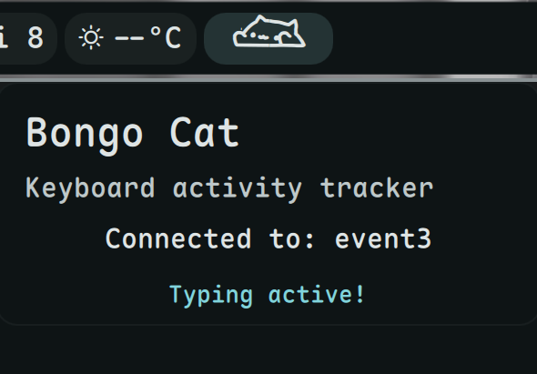

# Bongo Cat

Watch the cat tap its paws as you type!



## Install


**Required:** This plugin requires [dms-common](https://github.com/hthienloc/dms-common) to be installed.

```bash
# 1. Install shared components
git clone https://github.com/hthienloc/dms-common ~/.config/DankMaterialShell/plugins/dms-common

# 2. Install this plugin
dms plugins install bongoCat
```

Or manually:
```bash
git clone https://github.com/hthienloc/dms-bongo-cat ~/.config/DankMaterialShell/plugins/bongoCat
```

## Features

- **Real-time typing** - Cat reacts to your keyboard input
- **Big hit detection** - Space/Enter triggers double-paw animation
- **Blink & sleep** - Cat blinks when active, sleeps after inactivity
- **Adjustable size** - Customize cat size from 50% to 200%

## Usage

| Action | Result |
|--------|--------|
| Left click | Open settings |
| Right click | Toggle sleep mode |

## Requirements

- `evtest` - Keyboard event monitoring
- User must be in `input` group: `sudo usermod -aG input $USER`
## License

MIT

## Roadmap / TODO

- [ ] **Improved Key-Hold Logic:** Refine input polling to ensure paws stay down during sustained key presses.
- [ ] **Mouse Interaction:** Animate paws reacting to mouse button clicks and scroll events.
- [ ] **Performance Metrics (WPM):** Optional overlay showing real-time typing speed and accuracy.
- [ ] **Extended Skin Library:** Support for loading custom SVG/PNG skins and different "cat" variants (e.g., Robot-cat, Ghost-cat).
- [ ] **Audio Feedback:** Optional haptic-like mechanical keyboard sound effects on every keystroke.

MIT
